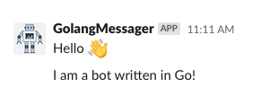

# Slackbot Golang

Libs in use in this project.

* `golang version 1.15`
* `github.com/nikoksr/notify v0.5.0`

Simple code for notification.

<p align="center">&nbsp;</img></p>

Sample code 

```golang
package main 

func main() {
notifier := notify.New()

slackService := slack.New("token")
slackService.AddReceivers("channel_id")

notifier.UseService(slackService)

if err := notifier.Send(
		"Hello :wave:",
		"Hello world",
	); err != nil {
		log.Fatal(err)
	}
} 
```

